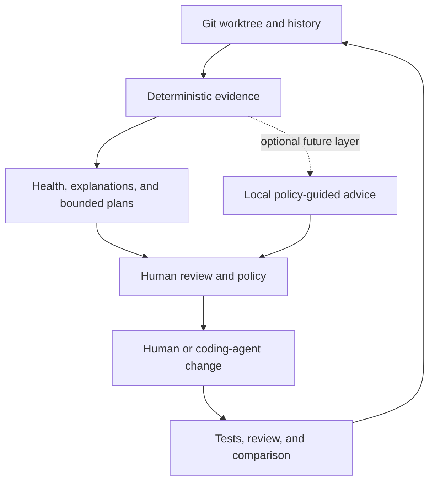

# Vision

Software repositories are becoming shared workspaces for humans and agents.
Most repositories are still shaped as if context were free.

It is not.

As a codebase grows, the cost is not only more lines of code. It is more
material to retrieve, more boundaries to cross, more duplicated knowledge to
reconcile, and more files that must change together. Humans experience that as
cognitive load and coordination overhead. Agents experience it as context
pressure, retrieval noise, additional inference, and a larger surface for
mistakes.

Git Slop exists to make that cost visible and actionable.

## The Category

Git Slop is a **language-agnostic token defragmenter for human-and-agent
software development**.

The metaphor is deliberate, but not literal. A disk defragmenter made scattered
blocks visible and reorganizable. Git Slop maps analogous friction in a
repository:

- files and folders that cost too much context to load
- one concept duplicated or scattered across many locations
- boundaries that repeatedly leak or move together
- high-traffic surfaces with broad change coordination
- expensive code with weak verification evidence
- knowledge that is hard to find, inconsistently named, or narrowly owned

Git Slop does not reorganize the repository automatically. It produces a map
that people and coding agents can use to improve the terrain deliberately.

## The Thesis

Models matter. Repository shape is part of the inference bill too.

A stronger model can reason over difficult code, but repository structure still
determines how much context must be retrieved, how much irrelevant material
travels with a change, and how many relationships must be reconstructed before
work can begin. The same structure affects human comprehension, review time,
onboarding, and maintenance risk.

Git Slop therefore treats repository shape as an observable systems problem,
not as a style preference.

It should answer two questions well:

1. **Context cost:** Which files and folders cost too much context to load,
   reason about, and safely change?
2. **Coordination cost:** Which concepts cost too much coordination because
   they are duplicated, scattered, weakly verified, difficult to navigate, or
   repeatedly forced to change together?

Those questions are related, but their evidence must remain separate.

- Context, age, and churn form the stable hotspot contract.
- Coordination and structural overlays add operational evidence.
- Health, explain, and plan surfaces consume that evidence without rewriting it.
- Optional reasoning may interpret candidates, but it must never own detector
  truth.

That separation is the trust architecture.

## The Human-and-Agent Loop

Git Slop is designed for a workflow in which machines improve visibility and
people retain judgment.

The intended loop is:

1. **Measure the repository.** Inventory tracked files, tokenize relevant
   context, and mine Git history deterministically.
2. **Explain the pressure.** Separate raw context load from maintenance,
   coordination, verification, navigation, stewardship, and drift evidence.
3. **Bound the work.** Propose small slices with explicit scope, exclusions,
   evidence, and verification expectations.
4. **Apply judgment.** A maintainer reviews the evidence and decides whether a
   change is warranted.
5. **Implement and verify.** A person or coding agent performs the selected
   work; normal tests, review, and Git remain authoritative.
6. **Measure again.** Compare reports to see what changed without inventing a
   causal story.

Git Slop is most useful when it narrows an ambiguous maintenance problem into a
reviewable place to begin.

## Current Product Contract

The shipped product is an open-source, local-first Rust CLI.

It:

- uses Git as the source of truth for inventory and history
- analyzes tracked text files without a hosted API
- measures context with a documented tokenizer and configurable bands
- produces deterministic hotspot scores from stable evidence
- reports structural and operational overlays separately
- writes versioned JSON and YAML for machines
- writes detailed and concise Markdown for people and CI
- explains individual paths, relationships, clusters, and ranked findings
- proposes bounded, non-mutating maintenance slices
- supports advisory CI by default and explicit enforcement when selected
- can package bounded evidence for optional local-model or coding-agent handoff

`find` owns detector truth. Downstream commands read existing reports; they do
not silently rescore the repository.

## Evidence Before Advice

Git Slop's first responsibility is to produce evidence that can be inspected,
reproduced, and challenged.

The detector should prefer:

- repository facts over generated opinions
- stable identifiers over prose-only conclusions
- explicit thresholds over hidden heuristics
- cited paths and relationships over general recommendations
- bounded scopes over repository-wide mandates
- uncertainty over fabricated confidence

Findings are prompts for investigation, not semantic proof. A large file may be
appropriate. Duplication may be deliberate. High churn may indicate healthy
investment. Weak test adjacency may be explained by another verification
boundary. The tool should make those conditions visible without pretending the
measurement contains the final judgment.

## Optional Policy-Guided Advice

The longer-term direction is a local, policy-governed repository improvement
system. The [planned advisory layer](https://github.com/coreycoto/git-slop/issues/52)
extends the workflow without weakening the detector. Its purpose is to turn
deterministic findings and candidate plan slices into contextual,
policy-governed recommendations.

The architecture has two distinct layers:

1. **Deterministic evidence and candidates.** `find`, `health`, `explain`,
   `plan`, and `check` remain reproducible and model-free.
2. **Policy-guided advice.** An optional local reasoner evaluates selected
   candidates against explicit policy packs and emits separate advisory
   artifacts.

Policy packs should be shareable by developers, teams, and companies without
requiring executable plugin code. They should be:

- declarative and data-only
- versioned and schema-validated
- content-addressed and lockable by digest
- locally inspectable and testable
- composable without overriding core invariants
- offline-capable after explicit installation

The first reference hypothesis is an `openai/gpt-oss-safeguard-20b` adapter
used as a policy evaluator: approve, revise, reject, or abstain with a cited
rationale. The recorded 16-GB M2 result is `defer`, so public inference remains
disabled and future evaluation is confined to a capacity-gated dedicated host.
That hypothesis must earn its place through quality, latency, memory, and
hallucination-resistance benchmarks. Git Slop should not require a second
general-purpose model unless evidence demonstrates a material gap.

Regardless of provider, model output must remain advisory and separate from the
canonical report. It cannot rewrite scores, weaken verification, invent paths,
expand scope silently, mutate source, or change CI gates.

## Core Principles

- **Local by default.** Repository data stays on the machine unless the user
  explicitly moves an artifact elsewhere.
- **Deterministic at the foundation.** The same repository state, analysis
  inputs, and configuration should produce the same detector truth.
- **Evidence is layered.** Context load, maintenance pressure, and overlays
  remain distinguishable.
- **Generated advice cites its work.** Every material claim must resolve to
  supplied repository or report evidence.
- **Plans are bounded.** Scope, exclusions, assumptions, and verification are
  explicit.
- **Humans retain authority.** Git Slop informs maintenance decisions; it does
  not make them unilaterally.
- **Agents inherit constraints.** A coding agent receives the same boundaries,
  evidence, and verification obligations as a human contributor.
- **Git remains authoritative.** Ordinary source control, tests, review, and
  repository policy govern every change.
- **Integration happens through artifacts.** Prefer stable reports, SARIF,
  prompt packs, and portable skills over hidden background behavior.
- **Limits should be observable.** Incomplete history, truncated context, and
  performance boundaries must be reported rather than concealed.

## Non-Goals

Git Slop is not:

- an AI-authorship detector
- an overall code-quality grade
- an LLM-based scoring or gating engine
- a hosted repository-telemetry product
- an autonomous refactoring system
- a replacement for tests, code review, or maintainer judgment
- a behavioral safety oracle
- a background daemon that silently watches or rewrites repositories
- an excuse to hide findings by weakening tests or expanding ignore rules

## Success Criteria

Git Slop succeeds when a maintainer can answer:

- Where is working context concentrated?
- Which expensive surfaces also carry meaningful maintenance pressure?
- Where is one idea fragmented, duplicated, or repeatedly coordinated?
- What evidence suggests verification, navigation, blast-radius, stewardship,
  or terminology risk?
- Which finding is worth investigating now?
- What is the smallest reviewable maintenance slice?
- What changed after the work?

The product succeeds at a systems level when:

- detector results remain reproducible and explainable
- large repositories have predictable resource use and visible limits
- generated artifacts are useful to both people and automation
- a plan can move from evidence to human review to agent implementation without
  losing scope or provenance
- teams can share policy without granting arbitrary code-execution privileges
- optional reasoning adds measurable value beyond the deterministic plan
- privacy and local operation remain defaults rather than premium features

## Direction

Near-term work should deepen the existing contract instead of replacing it:

- improve signal precision, performance, and large-repository behavior
- strengthen explain, plan, compare, health, and machine-readable artifacts
- validate declarative policy packs and the optional local advisor
- expand portable human-and-agent workflows around stable artifacts
- add editor-adjacent integrations only when real usage reveals a gap that
  reports, SARIF, prompt packs, or portable skills cannot fill

The durable goal is not to make Git Slop the agent that rewrites every
repository. It is to give humans and agents a better shared map of where the
repository has become expensive—and a bounded, trustworthy place to begin.
